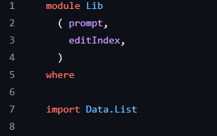

+++
date = '2025-02-21T08:43:55-08:00'
draft = false
title = 'Practica3: Haskell y Paradigma Funcional'
+++

## Introduccion 

Un paradigma funcional es un estilo de programación que construye programas aplicando y componiendo funciones. A diferencia de la programación imperativa, que se enfoca en cómo cambiar el estado del programa, la programación funcional se centra en qué calcular, tratando las funciones como "ciudadanos de primera clase" que pueden pasarse como argumentos y devolverse como resultados. Sus características principales incluyen la inmutabilidad de los datos y la ausencia de efectos secundarios.

La práctica realizada en el lenguaje de Haskell consta del uso de 2 archivos *Main.hs* y *Lib.hs* en el cual utilizando una lista se realizan acciones como agregar, eliminar o imprimir.

## Desarrollo

### Lib.hs

En el siguiente bloque de código define un módulo llamado Lib que organiza y exporta las funciones prompt y editIndex para que otros módulos puedan usarlas. Además, importa el módulo Data.List, que ofrece herramientas para trabajar con listas.

La función putTodo se encarga de formatear e imprimir una tarea en la consola. Recibe el índice de la tarea y un texto, y los muestra como "índice: tarea". La función prompt es el centro de la interacción con el usuario. Muestra un mensaje de bienvenida con los comandos disponibles como agregar, borrar, mostrar, editar, listar, revertir, limpiar o salir, y espera a que el usuario ingrese uno. Por lo que  prompt controla el flujo principal de la interacción con el usuario en la aplicación.

La función interpret gestiona una lista de tareas pendientes basándose en los comandos que recibe. Puedes añadir tareas usando +, eliminar una tarea específica con - seguido de su número, o mostrar una tarea concreta con s y su número. Para ver todas las tareas, usa l, y para verlas en orden inverso, usa r. Si quieres vaciar la lista, el comando es c. Finalmente, q cierra la aplicación. 

El siguiente bloque tiene dos funciones que trabajan con listas: deleteOne y showOne. La función deleteOne intenta quitar un elemento de una lista usando su índice. Si el índice es 0, remueve el primer elemento; si es un número mayor, intenta eliminar el elemento en la posición correspondiente en el resto de la lista. Si el índice es inválido devuelve Nothing, de lo contrario regresa Just la lista modificada. Por otro lado, la función showOne busca y devuelve un elemento específico de una lista por su índice. Primero, verifica si el índice es válido. Si no lo es, devuelve Nothing; si es válido, regresa Just el elemento encontrado en esa posición.

Este código Haskell te permite editar una tarea específica en tu lista. La función clave, editIndex reemplaza un elemento en cualquier posición de una lista por uno nuevo, dividiendo la lista, insertando el nuevo elemento y luego uniéndolas de nuevo. Para editar una tarea en tu lista, usas la función editTodo. Esta función espera un comando como con parametros de numero y texto, donde el número es el índice de la tarea que quieres cambiar. 

La función reverseTodos en Haskell invierte una lista utilizando un método recursivo. Funciona a través de una función auxiliar go que toma los elementos restantes de la lista original y una lista donde va acumulando el resultado. Cuando la lista original está vacía, la lista acumulada es el resultado final invertido. En cada paso, go toma el primer elemento de la lista original y lo añade al principio de la lista acumulada, invirtiendo así el orden de los elementos.

 

### Main.hs

Este código Haskell es el punto de inicio de la aplicación. Configura el entorno importando funciones esenciales de diversas fuentes para cargar variables de entorno desde un archivo .env, Lib para la función prompt, System.Environment para acceder a variables de entorno individuales y Web.Browser para la capacidad de abrir enlaces en el navegador web del usuario.

Primero, carga la configuración desde un archivo .env. Luego, busca una variable de entorno llamada "WEBSITE". Si no la encuentra, el programa se detiene y muestra un error, indicando que esta variable es necesaria. Si la encuentra, intenta abrir la URL especificada en el navegador predeterminado del usuario y luego informa si la operación fue exitosa. Finalmente el programa siempre muestra al usuario una lista de comandos disponibles para la aplicación de lista de tareas pendientes y después inicia la aplicación con una lista de tareas vacía.

## Conclusion

La práctica fue de mucho aprendizaje al ver un paradigma funcional implicado en código Haskell, en base a este se explicaron diferentes comandos y términos los cuales dan a entender de mejor manera.

