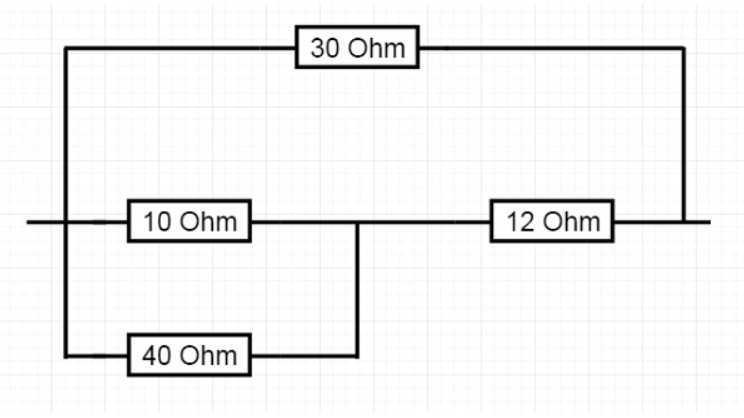

+++
date = '2025-02-21T08:43:55-08:00'
draft = false
title = 'Practica4: Prolog'
+++

## Introduccion 

En esta práctica se llevará a cabo una introducción al lenguaje de programación *Prolog* analizando programas básicos que nos da a entender un poco de su funcionamiento. Prolog se distingue de la mayoría de los lenguajes de programación como C++, Java, Python, JavaScript, etc. ya que su paradigma de programación. Mientras que la mayoría de los lenguajes son imperativos, Prolog es un lenguaje declarativo y, más específicamente, de programación lógica.

## Desarrollo

### Minimo y Maximo

El siguiente código define dos reglas en Prolog (find_max y find_min) que se usan para encontrar el máximo y el mínimo entre dos números, respectivamente. La regla “ find_max(X, Y, Max) ” determina el número más grande entre X e Y. Si X es mayor o igual que Y, entonces Max es X. El signo de exclamación “ ! ” es un corte que le dice a Prolog que si encuentra esta solución, no siga buscando otras alternativas para find_max. Si la primera condición no se cumple, entonces la segunda parte de la regla establece que Max es Y.

### Circuitos Resistivos

Ahora por medio de un programa se encontrará la resistencia equivalente de un circuito resistivo el cual es el siguiente: 

Para calcular la resistencia equivalente se ocupan ciertas fórmulas las cuales son las siguientes:
* Si R1 y R2 estan en serie, el resistor equivalente es Re = R1 + R2
* Si R1 y R2 están en paralelo,el resistor equivalente es Re = (R1 * R2) / (R1 + R2)

Tomando en cuenta lo anterior, se realizarán las siguientes operaciones: 
* R3 = (10 * 40)/(10 + 40) = 400/50 = 8 Ohm 
* R4 = R3 + 12 = 8 + 12 = 20 Ohm
* R5 = (20 * 30)/(20 + 30) = 12 Ohm

Debido a que primero la resistencia 10 y 40 Ohm están en paralelo, luego la resistencia resultante de 8 y 12 Ohm están en serie. Y por último la resistencia resultante de 20 y 30 Ohm están en paralelo. Esto realizado en código seria de la siguiente forma: 

### Segmentos de Recta

En este caso se identificarán qué rectas en una gráfica son horizontales, verticales y oblicuas. Para eso existen reglas las cuales en base a las coordenadas de la recta nos indican en qué posición están.

* En las rectas horizontales la coordenada Y en ambos extremos es la misma
* En las rectas verticales la coordenada X en ambos extremos es la misma
* Para las rectas oblicuas las coordenadas X, Y de ambos extremos son diferentes

De manera gráfica se visualizan así:

Una vez programa solo se tendría que ingresar el valor de las coordenadas o asignarlas a una variable para que nos diga qué tipo de recta son.

### Torres de Hanoi

Este problema es uno muy común el cual consiste en mover una cantidad cualquiera de discos de una torre a otra por medio de una torre auxiliar. Lo difícil se centra en que los discos varían en tamaño y tienen que ser colocados en la otra torre de la misma manera en la que estaban colocados inicialmente. Este juego sigue ciertas reglas lo cual lo hacen aún más complicado: 

* Un disco más grande no puede ser colocado sobre un disco mas chico
* Un disco a la vez se mueve

Este problema ya programado en Prolog se ve de la siguiente manera:

El output es extenso debido que para seguir las reglas establecidas debe realizar múltiples movimientos para poder realizar el objetivo.

### Listas Enlazadas

En este caso se muestra como generar una lista enlazada la cual consta de 2 componentes dentro del nodo, un valor y un “apuntador”. En este caso el apuntador apunta al valor del nodo siguiente dándole continuación a la lista. La lista llega a su fin cuando el último nodo apunta “nil”, osea que ya no hay un nodo siguiente. Se ha de aclarar que se pueden insertar nodos desde el inicio o fin de la lista.

### El Mono y el Platano

Este problema del mono y el plátano trata que un mono hambriento se encuentra en un cuarto, donde un plátano está colgando del techo sin poder alcanzarlo por su cuenta. Para esto ocupa un banquillo para así alcanzarlo, aunque este debe estar centrado con el plátano para llegar a él.

Este problema a simple vista parece fácil, y si lo es para un humano que tiene razonamiento lógico propio. Pero al momento de pasarlo a una máquina la cual no tiene ni un contexto de cómo funciona la mecánica del juego y de nada en general, se deben de establecer diferentes reglas para poder superar el juego.

## Conclusion

Esta práctica dio una introducción a Prolog destacando su paradigma de programación lógica y declarativa, que se diferencia de los lenguajes imperativos. A través de ejemplos prácticos como la determinación de mínimos y máximos, el cálculo de resistencias en circuitos, la clasificación de segmentos de recta, la resolución del problema de las Torres de Hanói, la manipulación de listas enlazadas y la implementación del problema del Mono y el Plátano, se ilustró cómo Prolog utiliza reglas y hechos para resolver problemas complejos de manera eficiente.

